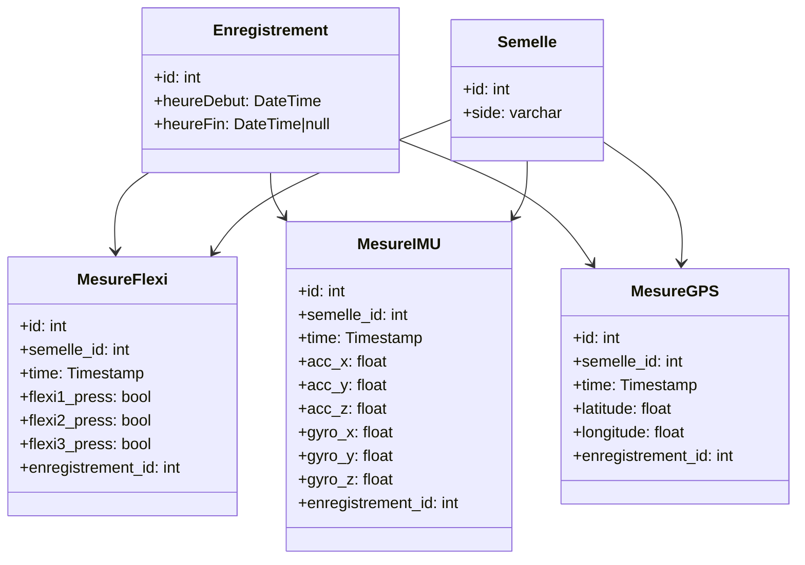

# Semelle

Semelle est l'application permettant de suivre les informations mesurées en temps réel par nos deux semelles, dans le
cadre de notre projet P2I.

## Technologies utilisées

- React : pour la création de l'interface utilisateur.
- Next.js : pour le rendu côté serveur et la génération de pages statiques.
- Tailwind CSS : pour la mise en forme et le design de l'application.
- HeroUI : pour les composants d'interface utilisateur.
- MariaDB : pour la gestion de la base de données.

## Installation

Pour installer Semelle, il suffit de cloner ce dépôt et d'installer les dépendances nécessaires à son fonctionnement.

```bash
git clone https://github.com/lpeyr/p2i
cd p2i/semelle
npm install
```

## Utilisation

Pour lancer l'application, il suffit d'exécuter la commande suivante dans le terminal :

```bash
npm run dev
```

Si vous ne voulez pas le mode développement :

```bash
npm run build
npm run start
```

## Schéma de la base de données



Au vu des contraintes liées au protocole LoRaWAN, nous avons choisi de limiter au maximum les données transmises, quitte
à renier sur la partie "en temps réel".
En effet, pour réaliser un suivi qualitatif de la marche, il est nécessaire de réaliser une acquisition au niveau de
l'IMU d'une fréquence de 2 à 5Hz, ce qui est incompatible avec les contraintes de LoRaWAN. Nous avons donc choisi de
faire en sorte que les semelles stockent les données mesurées en local, et de les transmettre à l'application Semelle
petit à petit, au fur et à mesure que les données sont mesurées. Ainsi, nous pouvons garantir une acquisition de
qualité, tout en respectant les contraintes de LoRaWAN.

Pour reconsistituer les données mesurées, nous allons effectuer un moyennage sur les différentes "étapes" de la marche,
en utilisant les données de flexion pour détecter les différentes phases (appui, décollage, etc.). Nous
pourrons ainsi reconstituer le trajet du pied, et analyser les différentes phases de la marche.

Il est donc nécessaire de stocker les données mesurées par chaque capteur dans une table spécifique, car chaque capteur
a une fréquence d'acquisition différente, et il est nécessaire de pouvoir les différencier pour pouvoir les analyser
correctement.
